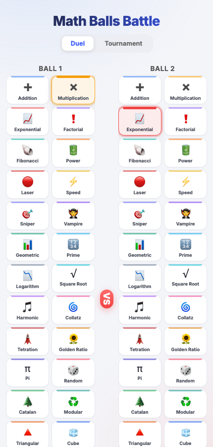

# math-balls-battle


Generates short "math battle" videos — two physics-driven ball simulations (e.g. multiplication vs. factorial growth) rendered frame-by-frame with canvas, narrated with TTS, captioned, and optionally published to Telegram/TikTok.

**[▶ Play in browser](https://detemen.github.io/math-balls-battle/)** — pick two of 27 ball types (each with its own damage formula) and watch them fight. Also has an 8-ball tournament bracket mode.



Sample video output: `battle_multiplication_vs_factorial.mp4`.

## Pipeline

- `index.html` / `main.js` / `game-core.js` — the browser game (no build step, static files)
- `render-video.js` / `game-core.js` — offline physics simulation + canvas rendering for video export (`@napi-rs/canvas`)
- `generate-tts.js` — text-to-speech narration (`node-gtts`)
- `generate-caption.js` — auto-generated captions
- `render-challenge.js` — assembles a full challenge video
- `telegram-bot.js` — Telegram bot for triggering renders (Telegraf)
- `tiktok-auth.js`, `tiktok-callback.html`, `tiktok-publish.js` — TikTok Content Posting API OAuth + publish flow

## Stack

Node.js, `@napi-rs/canvas`, Telegraf, TikTok Content Posting API.

## Running locally

```bash
npm install
cp .env.example .env   # bot token, TikTok API credentials
npm run render          # render a video
npm run bot              # start the Telegram bot
```
